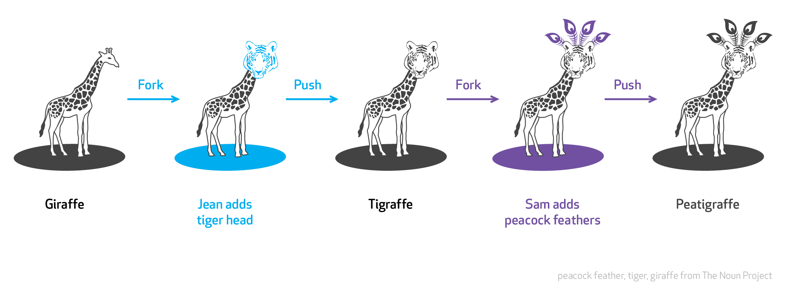

# Introduction

Welcome. My name is. A bit of personal story:

* Latex for PhD, found it amazing and extremely frustrating
* looked into simplifying my presentations and automating work and keeping lid on documents
* discovered interactive RStudio, python

* 'f' enable fullscreen mode
* 'w' toggle widescreen mode
* 'o' enable overview mode
* 'h' enable code highlight mode
* 'p' show presenter notes

## [Questionnaire results](http://bit.ly/GeoSeminarQ)

* Most interest in:
	* general understanding
	* making presentation
  * why would I use those tools instead of MS Office?
* everybody use Microsoft Office or equivalent
	* Latex and git reasonably known
	* Markdown not known

## Latex vs Word

A common perception is that:

* Microsoft Office is the most widely used office suite for a number of years now, mostly due to relative easy learning curve and  initial flexibility.
* Latex is predominantly of academic use, due to a steep learning curve, and while it handles complex equation and big documents well, it fares poorly when comparing the writing efficiency, especially when the grammar is considered.

## Latex perception

* <http://www.schuetzler.net/blog/latex-vs-word-again/>
 	* Latex separates the formatting of the document and the content of the document in a decent, logical way.
* [another](http://serialmentor.com/blog/2014/12/27/post-publication-review-of-the-plos-one-paper-comparing-ms-word-and-latex-how-not-to-compare-document-preparation)
	* Even though cumbersome and has its quirks, LaTeX is highly predictable

## Microsoft Office perception

](http://journals.plos.org/plosone/article/figure/image?size=large&id=info:doi/10.1371/journal.pone.0115069.g004){width=80%}

Microsoft Office user argue:

* easy it is to start
* flexible and comprehensive
* Latex with steep learning curve and complex syntax and poor visuals is just not good for industry

# Re-framing the question

## Change

* Change for the sake of change is rarely a sensible use of time.
* Tools have to fit the purpose.

The aim behind this talk is to address the balance between those two statements.

## What do I mean?

* Does content matters? Or the visuals?
* what is the most productive use of my time?
* How can I maintain the contribution from others? How do we archive documents?
* What about data fidelity?

## Does content matters?

## Who send what?

## Which is my latest copy?

* report_01.doc
* report_02.doc
* report_03_revByJim.doc
* report_04_changes.doc
* report_05_final.doc
* report_05_finalFinal.doc
* report_05_finalFinal_FINAL.doc
* report_05_finalFinal_FINAL_send.doc

## Sum of all parts

# Tools

## Markdown - Keep it simple

{ width=120% }

 Markdown was created to simplify HTML, but with the right tools, your Markdown files can easily be converted to many different formats!

## One to rule them all

## Control the time

# Some downsides

## Change

* Change for the sake of change is rarely a sensible use of time.
	* How are we going to interact with others?
* Tools have to fit the purpose.
	+ How many tools do I need to learn?
	+ Who maintain those tools?

The aim behind this talk is to address the balance between those two statements.

## How many tools are we using?

## Markdown - it's too flexible

There are too many ways of doing things and too many flavours of markdown.

# Some upsides

## Deep Work

## Maintaining research

The 2014 [Good Enough Practices in Scientific Computing](https://arxiv.org/abs/1609.00037v1) paper highlight need for:

* Data Management
* Software management
* Collaboration + project management

## Maintaining research

**Reproducible research**  - scientific claims, are published with their data and software code so that others may verify the findings and build upon them^[Roger Peng, Johns Hopkins University].

Examples:

* Gravitational Wave - <http://bit.ly/LIGO_OS>
* Stanford Exploration Project - <http://sepwww.stanford.edu/>
* West Virginia University's Computer vision Lab - <http://www.csee.wvu.edu/~xinl/>
* open source papers - <http://bit.ly/1MbL6C9>

## Open Source

# Examples

## Team work

## Auto-grading using git

## Social aspect

{ width=70% }

* [Hawkers in Singapore](https://rpubs.com/JoshMah/168498)
* [interactive plots](https://plot.ly/r/)

## Big guys do it

# Summary

## Take away notes

* There is a need for reproducible research
* Markdown is one of 20-80 tools - it will cover most of problems with a small effort
* content beats visuals
* data management and fidelity is important
* set of small dedicated tools allows for better flexibility and low entropy

## useful links

* [Try markdown online](http://dillinger.io/)
* Pandoc
	+ [try online](http://pandoc.org/try/)
	+ [check demos](http://pandoc.org/demos.html)
	+ <http://www.sphinx-doc.org>
* git
	+ [guide](http://rogerdudler.github.io/git-guide/)
	+ [try yourself](https://try.github.io/levels/1/challenges/10)
* R
  + [RMarkdown](http://rmarkdown.rstudio.com/)
  + [ioslides](http://rmarkdown.rstudio.com/ioslides_presentation_format.html)
  + [knit](https://sachsmc.github.io/knit-git-markr-guide/knitr/knit.html)

## Thank you

I hope you learn something new today.

It would be great to get feedback at <http://bit.ly/LKB_FB>.

Code is at <https://github.com/DfAC/NottinghamR_Markdown>.