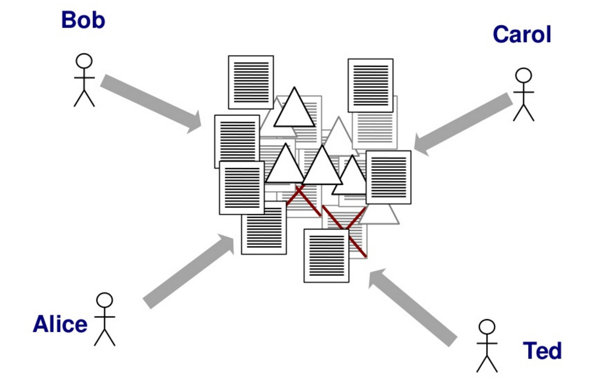

# Introduction

<div class="notes">

Welcome. My name is. A bit of personal story:

* I started with Word for MSc
* Latex for PhD, found it amazing and extremely frustrating
* at similar time discovered interactive RStudio, python
* looked into simplifying my presentations

</div>

## Questionnaire results

{ width=80% }

* Most interest in:
 + general understanding
 + making presentation + report
* more RStudio users than Microsoft Office
* git and Markdown more popular than Latex or Beamer
* More RMarkdown users than Markdown !


## Latex vs Word


<div class="notes">

A common perception is that:

* Microsoft Office is the most widely used office suite for a number of years now, mostly due to relative easy learning curve and  initial flexibility.
* Latex is predominantly of academic use, due to a steep learning curve, and while it handles complex equation and big documents well, it fares poorly when comparing the writing efficiency, especially when the grammar is considered.

</div>

## Latex perception


## Microsoft Office perception


{width = 80}
(An Efficiency Comparison of Document Preparation Systems Used in Academic Research and Development)[http://journals.plos.org/plosone/article?id=10.1371/journal.pone.0115069]

<div class="notes">

Microsoft Office user argue:

* easy it is to start
* flexible and comprehensive
* Latex with steep learning curve and complex syntax and poor visuals is just not good for industry

</div>


# Re-framing the question

## Change

* Change for the sake of change is rarely a sensible use of time.
* Tools have to fit the purpose.

<div class="notes">

The aim behind this talk is to address the balance between those two statements.

</div>

## What do I mean?

* Does content matters? Or the visuals?
* what is the most productive use of my time?
* How can I maintain the contribution from others? How do we archive documents?
* What about data fidelity?


## Does content matters?


## Who send what?



## Which is my latest copy?

* report_01.doc
* report_02.doc
* report_03_revByJim.doc
* report_04_changes.doc
* report_05_final.doc
* report_05_finalFinal.doc
* report_05_finalFinal_FINAL.doc
* report_05_finalFinal_FINAL_send.doc

## Social aspect

{ width=70% }

* [Hawkers in Singapore](https://rpubs.com/JoshMah/168498)
* [interactive plots](https://plot.ly/r/)


## Sum of all parts


## Deep Work


## Big guys open source


# Tools

## RStudio


## Markdown - Keep it simple

{ width=140% }


<div class="notes">

 Markdown was created to simplify HTML, but with the right tools, your Markdown files can easily be converted to many different formats!

</div>


## One to rule them all


## Control the time


# Some downsides

## Change

* Change for the sake of change is rarely a sensible use of time.
 + How are we going to interact with others?
* Tools have to fit the purpose.
 + How many tools do I need to learn?
 + Who maintain those tools?

<div class="notes">

The aim behind this talk is to address the balance between those two statements.

</div>

## How many tools are we using?


## Markdown - its too flexible


<div class="notes">

There are too many ways of doing things and too many flavours of markdown.

</div>

# Let's talk about this

<div class="notes">

* Which tools are missing?
* WHich are important?
* How easy it is to implement?

</div>

# Demo time


## Report example

```
pandoc 01Markdown.md --output=01Markdown.html
pandoc 02_Rmd+references.rmd --output=02_Rmd+ref.html
pandoc 02_Rmd+references.rmd --output=02_Rmd+ref.docx
pandoc 03_FinalReport.rmd --output= 03_FinalRep.docx
```

## Presentation example

```
pandoc -t beamer presentation.md -o simple.pdf
pandoc --slide-level 2 -H head.tex -B body.tex -t beamer
 presentation.md -V theme:metropolis -o Rpresentation.pdf
```

## Future work

* running R code inside presentation
* [converting back from MSc Office](http://pandoc.org/demos.html) - seamless integration
* animations + interactive content


# Summary

* simple tool allow to focus on content
* multiple components allow better flexibility and low entropy
* content


## useful links

* R
	+ [RMarkdown](http://rmarkdown.rstudio.com/)
	+ [ioslides](http://rmarkdown.rstudio.com/ioslides_presentation_format.html)
	+ [knit](https://sachsmc.github.io/knit-git-markr-guide/knitr/knit.html)
* Pandoc
	+ [try online](http://pandoc.org/try/)
	+ [check demos](http://pandoc.org/demos.html)
* git
	+ [guide](http://rogerdudler.github.io/git-guide/)
	+ [try yourself](https://try.github.io/levels/1/challenges/10)

## Thank you

Can you fill in the feedback at <http://bit.ly/LKBFeedback>?


lkbonenberg@gmail.com

@LKBLab

http://www.slideshare.net/LukaszKosmaBonenberg